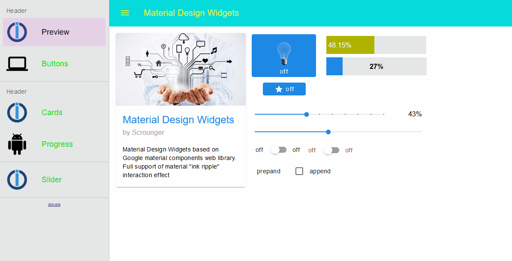
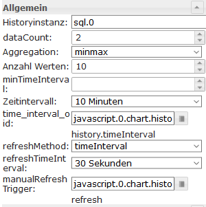
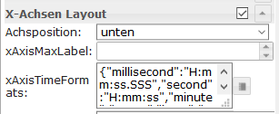
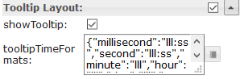

# ioBroker.vis-materialdesign

**Tests:**: 

## Material Design Widgets for IoBroker VIS

Material Design Widgets based on [Google material components web library](https://github.com/material-components/material-components-web).

Charts based on [chartjs library](https://www.chartjs.org/).

### Supported Browser
https://github.com/material-components/material-components-web/blob/master/docs/supported-browsers.md

## Button Toggle

## Card

## Icon Button

## List

## Progress

## Slider

Settings that are not listed in the table below are self-explanatory.

<table>
    <thead>
        <tr>
            <th>Screenshot</th>
            <th>Setting</th>
            <th>Description</th>
        </tr>
    </thead>
    <tbody>
        <tr>
            <td rowspan=6></td>
            <td>initDelay</td>
            <td>If the slider is not visible or operable after loading the runtime, then this value must be increased. Entry is made in milliseconds. For example, increase by 250 steps until the slider works.</td>
        </tr>
    </tbody>
</table>

## Switch

## Top App Bar with Navigation Drawer

Information:
* App Bar position is hardcoded and always appears in the upper left corner. Only width and height are adjustable. In the editor you can move the widget, but these settings will not be applied!
* In the editor, effects such as scrolling, etc. are not displayed correctly or behave differently!
* Checkbox "persistent" must be activated!

##### Layout modal:

##### Layout dismissible:

##### Layout permanent:

### Submenu 

Settings that are not listed in the table below are self-explanatory.

<table>
    <thead>
        <tr>
            <th>Screenshot</th>
            <th>Setting</th>
            <th>Description</th>
        </tr>
    </thead>
    <tbody>
        <tr>
            <td rowspan=1></td>
            <td>views[x]</td>
            <td>To activate submenu, you have to add multiple views seperated with '|' into the view field, see screenshots</td>
        </tr>
        <tr>
            <td rowspan=1></td>
            <td>label[x]</td>
            <td>To change the text of the items, you have to put a json object into the label field with the index of the view field. 
                Example: 

`{"itemText": "Item with Subitems", "subItems": ["subItem1", "subItem2"]}`

Result: see screenshot</td>
        </tr>
        <tr>
            <td rowspan=1></td>
            <td>icon[x]</td>
            <td>To change the icons of the items, you have to put a json object into the icons field with the index of the view field. 
                Example: 

`{"itemImage": "/icons-material-svg/hardware/ic_computer_48px.svg", "subItems": ["/vis/widgets/materialdesign/img/IoBroker_Logo.png", "/icons-material-svg/action/ic_android_48px.svg"]}`

Result: see screenshot</td>
        </tr>
    </tbody>
</table>

## Charts

### Line History Chart:

> Required Adapter: [SQL](https://github.com/ioBroker/ioBroker.sql) or [History](https://github.com/ioBroker/ioBroker.history) !

Settings that are not listed in the table below are self-explanatory.

<table>
    <thead>
        <tr>
            <th>Screenshot</th>
            <th>Setting</th>
            <th>Description</th>
        </tr>
    </thead>
    <tbody>
        <tr>
            <td rowspan=6></td>
            <td>Instance</td>
            <td>Instance for the sql or history adapter</td>
        </tr>
        <tr>
            <td>aggregation</td>
            <td><a href="https://www.iobroker.net/docu/index-195.htm?page_id=198&lang=en#Aggregation">link</a></td>
        </tr>
        <tr>
            <td>count</td>
            <td>Number of maximum data points to display</td>
        </tr>
        <tr>
            <td>minTimeInterval</td>
            <td>Optional setting, overrides the 'count' setting. Distance between the individual data points in seconds. For example, if you want to display data points every minute, you have to enter 60 here</td>
        </tr>
        <tr>
            <td>timeIntervalOid</td>
            <td>Id of a datapoint to change the time interval of the chart. The data point must be a string and may contain <a href="https://github.com/Scrounger/ioBroker.vis-materialdesign/blob/235530e4e54346b5527333ca06ce596519954c67/widgets/materialdesign/js/materialdesign.chart.js#L802">the linked values</a> For example, you can use a button here to change the display of the chart during runtime</td>
        </tr>
        <tr>
            <td>manualRefreshTrigger</td>
            <td>Id of adatapoint to trigger a manual refresh of the chart. For example, you can use a button here to refresh the chart during runtime</td>
        </tr>
        <tr>
            <td></td>
            <td>xAxisTimeFormat</td>
            <td>Change the time format of the X-axis. Time formats must be entered for all time units, <a href="https://github.com/Scrounger/ioBroker.vis-materialdesign/blob/c677220868961b3cf0b153fb8bf04e13b4475c09/widgets/materialdesign/js/materialdesign.chart.js#L805">the following time units are permitted.</a> Approved time formats must be entered according to the moment.js library, <a href="https://momentjs.com/docs/#/displaying/">see link</a></td>
        </tr>
        <tr>
            <td></td>
            <td>tooltipTimeFormat</td>
            <td>Change the time format of the tooltip. Time formats must be entered for all time units, <a href="https://github.com/Scrounger/ioBroker.vis-materialdesign/blob/c677220868961b3cf0b153fb8bf04e13b4475c09/widgets/materialdesign/js/materialdesign.chart.js#L805">the following time units are permitted.</a> Approved time formats must be entered according to the moment.js library, <a href="https://momentjs.com/docs/#/displaying/">see link</a></td>
        </tr>
    </tbody>
</table>

## Changelog

### 0.1.5
* (Scrounger): bar chart added
* (Scrounger): pie chart added
* (Scrounger): bug fixes

### 0.1.2
* (Scrounger): list: right label option added
* (Scrounger): slider: value text option for lees or greather than added
* (Scrounger): switch: support for non boolean values added
* (Scrounger): checkbox: support for non boolean values added
* (Scrounger): buttons: image position option added
* (Scrounger): toggle buttons: support for non boolean values added
* (Scrounger): topAppBar: z-Index added
* (Scrounger): haptic feedback (vibration) option for mobil browser added
* (Scrounger): editor text fields changed to html
* (Scrounger): mdc-typography font styles added
* (Scrounger): bug fixes

### 0.1.1
* (Scrounger): bug fixes

### 0.1.0
* (Scrounger): Top App Bar Submenu added
* (Scrounger): List added
* (Scrounger): Button vertical State, Link, Nav added
* (Scrounger): Icon Button State, Link, Nav added
* (Scrounger): initialize slider bug fixes
* (Scrounger): moved hard coded styling options to css
* (Scrounger): styling options extended
* (Scrounger): bug fixes

### 0.0.7
* (Scrounger): Top App Bar Layouts added
* (Scrounger): Top App Bar customizing options added
* (Scrounger): Top App Bar Navigation Drawer backdrop layout added
* (Scrounger): Button State added
* (Scrounger): Button Link added

### 0.0.6
* (Scrounger): Top App Bar with Navigation Drawer added
* (Scrounger): Checkbox added
* (Scrounger): bug fixes
 
### 0.0.5
* (Scrounger): icon button Toggle added
* (Scrounger): color pressed for buttons added
* (Scrounger): Slider bug fix & label for value <= min / >= max added
* (Scrounger): translation added

### 0.0.4
* (Scrounger): cards added

### 0.0.3
* (Scrounger): progress added
 
### 0.0.2
* (Scrounger): slider vertical added
* (Scrounger): switch added
* (Scrounger): button toggle added

### 0.0.1
* (Scrounger) initial release

## License
MIT License

Copyright (c) 2019 Scrounger <scrounger@gmx.net>

Permission is hereby granted, free of charge, to any person obtaining a copy
of this software and associated documentation files (the "Software"), to deal
in the Software without restriction, including without limitation the rights
to use, copy, modify, merge, publish, distribute, sublicense, and/or sell
copies of the Software, and to permit persons to whom the Software is
furnished to do so, subject to the following conditions:

The above copyright notice and this permission notice shall be included in all
copies or substantial portions of the Software.

THE SOFTWARE IS PROVIDED "AS IS", WITHOUT WARRANTY OF ANY KIND, EXPRESS OR
IMPLIED, INCLUDING BUT NOT LIMITED TO THE WARRANTIES OF MERCHANTABILITY,
FITNESS FOR A PARTICULAR PURPOSE AND NONINFRINGEMENT. IN NO EVENT SHALL THE
AUTHORS OR COPYRIGHT HOLDERS BE LIABLE FOR ANY CLAIM, DAMAGES OR OTHER
LIABILITY, WHETHER IN AN ACTION OF CONTRACT, TORT OR OTHERWISE, ARISING FROM,
OUT OF OR IN CONNECTION WITH THE SOFTWARE OR THE USE OR OTHER DEALINGS IN THE
SOFTWARE.
