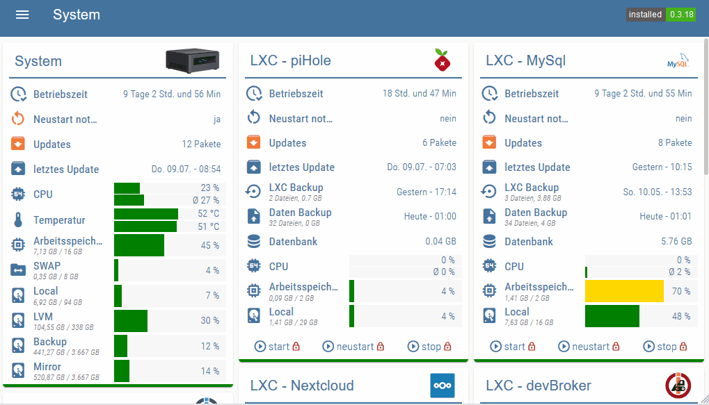
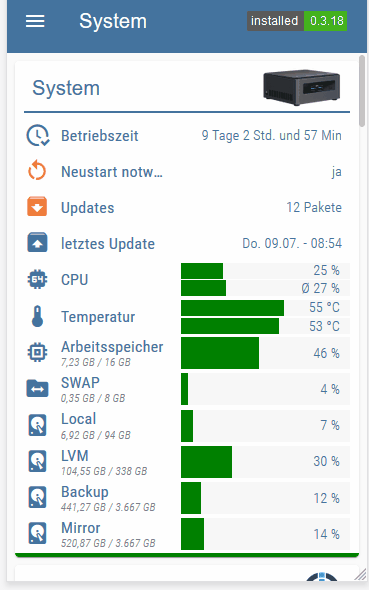
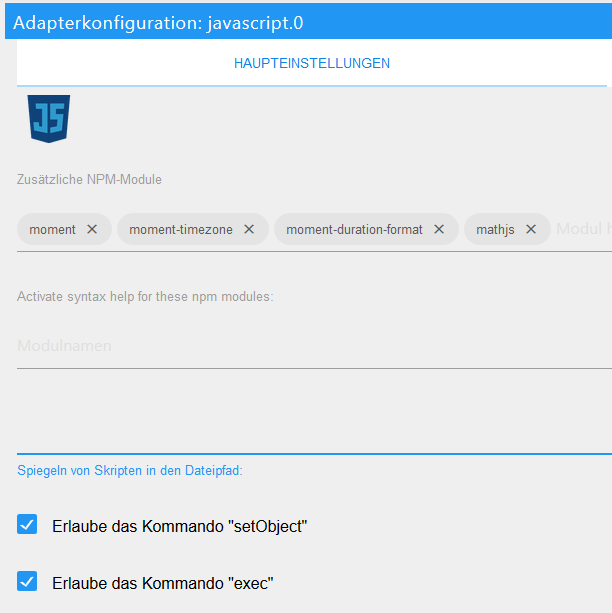

# Proxmox Beispiel Projekt für Material Design Widgets

Ein Beispiel Projekt für eine responsiv VIS View mit Proxmox Daten.

[](https://www.paypal.com/cgi-bin/webscr?cmd=_s-xclick&hosted_button_id=VWAXSTS634G88&source=url)

 

### Voraussetzungen

###### Folgende Adapter werden benötigt:
* [Material Design Widgets](https://github.com/Scrounger/ioBroker.vis-materialdesign) >= 0.3.19
* [Proxmox](https://github.com/iobroker-community-adapters/ioBroker.proxmox) >= 1.0.2
* [Javascript ](https://github.com/ioBroker/ioBroker.javascript) >= 4.6.1

###### Folgende NPM Module und Einstellung im Javascript Adapter:
* moment
* moment-timezone
* moment-duration-format
* mathjs
* Einstellung `Erlaub das Kommando "setObject"` muss aktiviert sein



### Installation

1. [Skript herunterladen](Proxmox.js) und unter Skripte anlegen
2. Skript Einstellungen anpassen, id der Datenpunkte müssen angeben werden, [siehe Skript Einstellungen](#Skript-Einstellungen)!
3. zweimal das Skript ausführen. Beim ersten Mal werden die Datenpunkte angelegt, beim zweiten Mal die Werte erzeugt.
4. Widget importieren , [siehe Widget](#Widgets)

### Skript Einstellungen
Im oberen Bereich des Skriptes gibt es verschiedene Einstellungsmöglichkeiten inkl. derer Beschreibung.

Hier muss zwingend die Ids für eure node / lxc / vm Datenpunkte angepasst werden.

Zusätzlich können noch weitere Datenpunkte (nicht vom Proxmox Adapter) hinzugefügt werden. Beispiele dazu findet ihr im Skript. Diesen Datenpunkten kann man verschiedene types zuordnen. Durch die types wird die Darstellung definiert. Ggf. sind Anpassungen in der Funktion `generateCustomRow` notwendigg bzw. hier könnt ihr weiteres types definieren. 

```
// Skript Einstellungen *************************************************************************************************************************************************
let idDatenpunktPrefix = '0_userdata.0'                                                                         // '0_userdata.0' or 'javascript.x'
let idDatenPunktStrukturPrefix = 'vis.MaterialDesignWidgets.Proxmox'                                            // Struktur unter Prefix

let triggerDatenpunkt = "proxmox.0.node_proxmox.uptime";                                                        // Datenpunkt um Skript Ausführung zu triggern (z.B. uptime einer Node)

let cpuAverageLastValues = 60;                                                                                  // Wieviele Werte zur Berechnung der durchschnittlichen CPU Last verwendet werden sollen

let nodesList = [
    {
        idChannel: 'proxmox.0.node_proxmox',                                                                    // id des Channels der Node
        targetChannel: 'promox',                                                                                // id unter der der json string für das Table Widget gespeichert werden soll
        name: 'System',                                                                                         // name der als Titel angezeigt werden soll
        image: '/vis.0/myImages/nuc.png',                                                                       // Bild das im Titel angezeigt werden soll
        url: 'https://10.25.1.10:8006/',                                                                        // Url die aufgerufen wird beim Klick auf den Titel
        showControlButtons: false,                                                                              // Buttons für start, restart, stop anzeigen
        temperatures: ['linkeddevices.0.System.Temperatur.Core_0', 'linkeddevices.0.System.Temperatur.Core_1'], // Datenpunkte für Temperatur (1 oder 2 Datenpunkte, entfernen wenn nicht benötigt)
        storages: [                                                                                             // Storage Datenpunkt anzeigen
            {
                idChannel: 'proxmox.0.storage_local',                                                           // id des Storage Datenpunkts
                text: 'Local',                                                                                  // Text der für den Storage angezeigt werden soll
                icon: 'harddisk'                                                                                // Icon das für den Storage angezeigt werden soll
            },
            {
                idChannel: 'proxmox.0.storage_local-lvm',
                text: 'LVM',
                icon: 'harddisk'
            },
            {
                idChannel: 'proxmox.0.storage_Backup',
                text: 'Backup',
                icon: 'harddisk'
            },
            {
                idChannel: 'proxmox.0.storage_Mirror',
                text: 'Mirror',
                icon: 'harddisk'
            }
        ],
        custom: [                                                                                               // eigene Datenpunkte die mit aufgelistet werden sollen
            {
                id: 'linux-control.0.proxmox.needrestart.needrestart',                                          // id des Datenpunktes
                text: 'Neustart notwendig',                                                                     // text der angezeigt werden soll
                icon: 'restart',                                                                                // icon das angezeigt werden soll
                type: 'boolean',                                                                                // welche Funktion verwendet werden soll
                attention: true                                                                                 // ob Attention Farbe angezeigt werden soll
            },
            {
                id: 'linux-control.0.proxmox.updates.newPackages',                                              // id des Datenpunktes
                text: 'Updates',                                                                                // text der angezeigt werden soll
                icon: 'package-down',                                                                           // icon das angezeigt werden soll
                type: 'number',                                                                                 // welche Funktion verwendet werden soll
                attention: true                                                                                 // ob Attention Farbe angezeigt werden soll
            },
            {
                id: 'linux-control.0.proxmox.updates.lastUpdate',                                               // id des Datenpunktes
                text: 'letztes Update',                                                                         // text der angezeigt werden soll
                icon: 'package-up',                                                                             // icon das angezeigt werden soll
                type: 'timestamp',                                                                              // welche Funktion verwendet werden soll
            }
        ]
    }
]

let vmList = [
    {
        idChannel: 'proxmox.0.lxc_ioBroker',                                                                    // id des Channels der Node
        targetChannel: 'lxc_ioBroker',                                                                          // id unter der der json string für das Table Widget gespeichert werden soll
        name: 'LXC - ioBroker',                                                                                 // name der als Titel angezeigt werden soll
        image: '/vis.0/myImages/iobroker.png',                                                                  // Bild das im Titel angezeigt werden soll
        url: 'https://10.25.1.15:8081/login/index.html?href=%2F',                                               // Url die aufgerufen wird beim Klick auf den Titel
        custom: [                                                                                               // eigene Datenpunkte die mit aufgelistet werden sollen
            {
                id: 'linux-control.0.lxc_ioBroker.needrestart.needrestart',                                     // id des Datenpunktes
                text: 'Neustart notwendig',                                                                     // text der angezeigt werden soll
                icon: 'restart',                                                                                // icon das angezeigt werden soll
                type: 'boolean',                                                                                // welche Funktion verwendet werden soll
                attention: true                                                                                 // ob Attention Farbe angezeigt werden soll
            },
            {
                id: 'linux-control.0.lxc_ioBroker.updates.newPackages',                                         // id des Datenpunktes
                text: 'Updates',                                                                                // text der angezeigt werden soll
                icon: 'package-down',                                                                           // icon das angezeigt werden soll
                type: 'number',                                                                                 // welche Funktion verwendet werden soll
                attention: true                                                                                 // ob Attention Farbe angezeigt werden soll
            },
            {
                id: 'linux-control.0.lxc_ioBroker.updates.lastUpdate',                                          // id des Datenpunktes
                text: 'letztes Update',                                                                         // text der angezeigt werden soll
                icon: 'package-up',                                                                             // icon das angezeigt werden soll
                type: 'timestamp',                                                                              // welche Funktion verwendet werden soll
            },
            {
                id: 'linux-control.0.lxc_ioBroker.backup.container.timestamp',                                  // id des Datenpunktes
                secondIds: [                                                                                    // ids für subtext
                    'linux-control.0.lxc_ioBroker.backup.container.files',
                    'linux-control.0.lxc_ioBroker.backup.container.size'
                ],
                text: 'LXC Backup',                                                                             // text der angezeigt werden soll
                icon: 'backup-restore',                                                                         // icon das angezeigt werden soll
                type: 'timestampInSeconds'
            },
            {
                id: 'linux-control.0.lxc_ioBroker.backup.data.timestamp',                                       // id des Datenpunktes
                secondIds: [                                                                                    // ids für subtext
                    'linux-control.0.lxc_ioBroker.backup.data.files',
                    'linux-control.0.lxc_ioBroker.backup.data.size'
                ],
                text: 'Daten Backup',                                                                           // text der angezeigt werden soll
                icon: 'file-upload',                                                                            // icon das angezeigt werden soll
                type: 'timestampInSeconds'
            },
            {
                id: 'linux-control.0.lxc_ioBroker.folders.ioBroker',                                            // id des Datenpunktes
                text: 'Ordnergröße',                                                                            // text der angezeigt werden soll
                icon: 'folder-information',                                                                     // icon das angezeigt werden soll
            },
            {
                id: 'linux-control.0.lxc_ioBroker.folders.npm_cache',                                           // id des Datenpunktes
                text: 'NPM Cache',                                                                              // text der angezeigt werden soll
                icon: 'folder-clock',                                                                           // icon das angezeigt werden soll
            }
        ]
    },
    {
        idChannel: 'proxmox.0.lxc_NextCloud',                                                                    // id des Channels der Node
        targetChannel: 'lxc_NextCloud',                                                                          // id unter der der json string für das Table Widget gespeichert werden soll
        name: 'LXC - Nextcloud',                                                                                 // name der als Titel angezeigt werden soll
        image: '/vis.0/myImages/nextcloud-icon.png',                                                             // Bild das im Titel angezeigt werden soll
        url: 'https://10.25.1.14/index.php/login',                                                               // Url die aufgerufen wird beim Klick auf den Titel
        custom: [                                                                                                // eigene Datenpunkte die mit aufgelistet werden sollen
            {
                id: 'linux-control.0.lxc_NextCloud.needrestart.needrestart',                                    // id des Datenpunktes
                text: 'Neustart notwendig',                                                                     // text der angezeigt werden soll
                icon: 'restart',                                                                                // icon das angezeigt werden soll
                type: 'boolean',                                                                                // welche Funktion verwendet werden soll
                attention: true                                                                                 // ob Attention Farbe angezeigt werden soll
            },
            {
                id: 'linux-control.0.lxc_NextCloud.updates.newPackages',                                         // id des Datenpunktes
                text: 'Updates',                                                                                // text der angezeigt werden soll
                icon: 'package-down',                                                                           // icon das angezeigt werden soll
                type: 'number',                                                                                 // welche Funktion verwendet werden soll
                attention: true                                                                                 // ob Attention Farbe angezeigt werden soll
            },
            {
                id: 'linux-control.0.lxc_NextCloud.updates.lastUpdate',                                          // id des Datenpunktes
                text: 'letztes Update',                                                                         // text der angezeigt werden soll
                icon: 'package-up',                                                                             // icon das angezeigt werden soll
                type: 'timestamp',                                                                              // welche Funktion verwendet werden soll
            },
            {
                id: 'linux-control.0.lxc_NextCloud.backup.container.timestamp',                                  // id des Datenpunktes
                secondIds: [                                                                                     // ids für subtext
                    'linux-control.0.lxc_NextCloud.backup.container.files',
                    'linux-control.0.lxc_NextCloud.backup.container.size'
                ],
                text: 'LXC Backup',                                                                              // text der angezeigt werden soll
                icon: 'backup-restore',                                                                          // icon das angezeigt werden soll
                type: 'timestampInSeconds'
            },
            {
                id: 'linux-control.0.lxc_NextCloud.folders.userData',                                            // id des Datenpunktes
                text: 'Benutzerdaten',                                                                           // text der angezeigt werden soll
                icon: 'folder-account',                                                                          // icon das angezeigt werden soll
            }
        ]
    },
    {
        idChannel: 'proxmox.0.lxc_Waihona',                                                                      // id des Channels der Node
        targetChannel: 'lxc_Waihona',                                                                            // id unter der der json string für das Table Widget gespeichert werden soll
        name: 'LXC - Waihona',                                                                                   // name der als Titel angezeigt werden soll
        image: '/vis.0/myImages/samba.png',                                                                      // Bild das im Titel angezeigt werden soll
        url: 'https://10.25.1.12:8000/',                                                                         // Url die aufgerufen wird beim Klick auf den Titel
        custom: [                                                                                                // eigene Datenpunkte die mit aufgelistet werden sollen
            {
                id: 'linux-control.0.lxc_Waihona.needrestart.needrestart',                                    // id des Datenpunktes
                text: 'Neustart notwendig',                                                                     // text der angezeigt werden soll
                icon: 'restart',                                                                                // icon das angezeigt werden soll
                type: 'boolean',                                                                                // welche Funktion verwendet werden soll
                attention: true                                                                                 // ob Attention Farbe angezeigt werden soll
            },
            {
                id: 'linux-control.0.lxc_Waihona.updates.newPackages',                                         // id des Datenpunktes
                text: 'Updates',                                                                                // text der angezeigt werden soll
                icon: 'package-down',                                                                           // icon das angezeigt werden soll
                type: 'number',                                                                                 // welche Funktion verwendet werden soll
                attention: true                                                                                 // ob Attention Farbe angezeigt werden soll
            },
            {
                id: 'linux-control.0.lxc_Waihona.updates.lastUpdate',                                          // id des Datenpunktes
                text: 'letztes Update',                                                                         // text der angezeigt werden soll
                icon: 'package-up',                                                                             // icon das angezeigt werden soll
                type: 'timestamp',                                                                              // welche Funktion verwendet werden soll
            },
            {
                id: 'linux-control.0.lxc_Waihona.backup.container.timestamp',                                    // id des Datenpunktes
                secondIds: [                                                                                     // ids für subtext
                    'linux-control.0.lxc_Waihona.backup.container.files',
                    'linux-control.0.lxc_Waihona.backup.container.size'
                ],
                text: 'LXC Backup',                                                                              // text der angezeigt werden soll
                icon: 'backup-restore',                                                                          // icon das angezeigt werden soll
                type: 'timestampInSeconds'
            }
        ]
    },
    {
        idChannel: 'proxmox.0.lxc_MySql',                                                                        // id des Channels der Node
        targetChannel: 'lxc_MySql',                                                                              // id unter der der json string für das Table Widget gespeichert werden soll
        name: 'LXC - MySql',                                                                                     // name der als Titel angezeigt werden soll
        image: '/vis.0/myImages/MySql.png',                                                                      // Bild das im Titel angezeigt werden soll
        custom: [                                                                                                // eigene Datenpunkte die mit aufgelistet werden sollen
            {
                id: 'linux-control.0.lxc_MySql.needrestart.needrestart',                                    // id des Datenpunktes
                text: 'Neustart notwendig',                                                                     // text der angezeigt werden soll
                icon: 'restart',                                                                                // icon das angezeigt werden soll
                type: 'boolean',                                                                                // welche Funktion verwendet werden soll
                attention: true                                                                                 // ob Attention Farbe angezeigt werden soll
            },
            {
                id: 'linux-control.0.lxc_MySql.updates.newPackages',                                         // id des Datenpunktes
                text: 'Updates',                                                                                // text der angezeigt werden soll
                icon: 'package-down',                                                                           // icon das angezeigt werden soll
                type: 'number',                                                                                 // welche Funktion verwendet werden soll
                attention: true                                                                                 // ob Attention Farbe angezeigt werden soll
            },
            {
                id: 'linux-control.0.lxc_MySql.updates.lastUpdate',                                          // id des Datenpunktes
                text: 'letztes Update',                                                                         // text der angezeigt werden soll
                icon: 'package-up',                                                                             // icon das angezeigt werden soll
                type: 'timestamp',                                                                              // welche Funktion verwendet werden soll
            },
            {
                id: 'linux-control.0.lxc_MySql.backup.container.timestamp',                                      // id des Datenpunktes
                secondIds: [                                                                                     // ids für subtext
                    'linux-control.0.lxc_MySql.backup.container.files',
                    'linux-control.0.lxc_MySql.backup.container.size'
                ],
                text: 'LXC Backup',                                                                              // text der angezeigt werden soll
                icon: 'backup-restore',                                                                          // icon das angezeigt werden soll
                type: 'timestampInSeconds'
            },
            {
                id: 'linux-control.0.lxc_MySql.backup.data.timestamp',                                          // id des Datenpunktes
                secondIds: [                                                                                    // ids für subtext
                    'linux-control.0.lxc_MySql.backup.data.files',
                    'linux-control.0.lxc_MySql.backup.data.size'
                ],
                text: 'Daten Backup',                                                                           // text der angezeigt werden soll
                icon: 'file-upload',                                                                            // icon das angezeigt werden soll
                type: 'timestampInSeconds'
            },
            {
                id: 'linux-control.0.lxc_MySql.folders.databaseSize',                                            // id des Datenpunktes
                text: 'Datenbank',                                                                               // text der angezeigt werden soll
                icon: 'database',                                                                                // icon das angezeigt werden soll
            }
        ]
    },
    {
        idChannel: 'proxmox.0.lxc_piHole',                                                                       // id des Channels der Node
        targetChannel: 'lxc_piHole',                                                                             // id unter der der json string für das Table Widget gespeichert werden soll
        name: 'LXC - piHole',                                                                                    // name der als Titel angezeigt werden soll
        image: '/vis.0/myImages/pihole.png',                                                                     // Bild das im Titel angezeigt werden soll
        url: 'https://10.25.1.11/admin/',                                                                        // Url die aufgerufen wird beim Klick auf den Titel
        custom: [                                                                                                // eigene Datenpunkte die mit aufgelistet werden sollen
            {
                id: 'linux-control.0.lxc_piHole.needrestart.needrestart',                                    // id des Datenpunktes
                text: 'Neustart notwendig',                                                                     // text der angezeigt werden soll
                icon: 'restart',                                                                                // icon das angezeigt werden soll
                type: 'boolean',                                                                                // welche Funktion verwendet werden soll
                attention: true                                                                                 // ob Attention Farbe angezeigt werden soll
            },
            {
                id: 'linux-control.0.lxc_piHole.updates.newPackages',                                         // id des Datenpunktes
                text: 'Updates',                                                                                // text der angezeigt werden soll
                icon: 'package-down',                                                                           // icon das angezeigt werden soll
                type: 'number',                                                                                 // welche Funktion verwendet werden soll
                attention: true                                                                                 // ob Attention Farbe angezeigt werden soll
            },
            {
                id: 'linux-control.0.lxc_piHole.updates.lastUpdate',                                          // id des Datenpunktes
                text: 'letztes Update',                                                                         // text der angezeigt werden soll
                icon: 'package-up',                                                                             // icon das angezeigt werden soll
                type: 'timestamp',                                                                              // welche Funktion verwendet werden soll
            },
            {
                id: 'linux-control.0.lxc_piHole.backup.container.timestamp',                                     // id des Datenpunktes
                secondIds: [                                                                                     // ids für subtext
                    'linux-control.0.lxc_piHole.backup.container.files',
                    'linux-control.0.lxc_piHole.backup.container.size'
                ],
                text: 'LXC Backup',                                                                              // text der angezeigt werden soll
                icon: 'backup-restore',                                                                          // icon das angezeigt werden soll
                type: 'timestampInSeconds'
            },
            {
                id: 'linux-control.0.lxc_piHole.backup.data.timestamp',                                         // id des Datenpunktes
                secondIds: [                                                                                    // ids für subtext
                    'linux-control.0.lxc_piHole.backup.data.files',
                    'linux-control.0.lxc_piHole.backup.data.size'
                ],
                text: 'Daten Backup',                                                                           // text der angezeigt werden soll
                icon: 'file-upload',                                                                            // icon das angezeigt werden soll
                type: 'timestampInSeconds'
            },
            {
                id: 'linux-control.0.lxc_piHole.folders.databaseSize',                                           // id des Datenpunktes
                text: 'Datenbank',                                                                               // text der angezeigt werden soll
                icon: 'database',                                                                                // icon das angezeigt werden soll
            }
        ]
    },
    {
        idChannel: 'proxmox.0.lxc_devBroker',                                                                    // id des Channels der Node
        targetChannel: 'lxc_devBroker',                                                                          // id unter der der json string für das Table Widget gespeichert werden soll
        name: 'LXC - devBroker',                                                                                 // name der als Titel angezeigt werden soll
        image: '/vis.0/myImages/devBroker.png',                                                                  // Bild das im Titel angezeigt werden soll
        url: 'https://10.25.1.17:8081/login/index.html?href=%2F',                                                // Url die aufgerufen wird beim Klick auf den Titel
        custom: [                                                                                                // eigene Datenpunkte die mit aufgelistet werden sollen
            {
                id: 'linux-control.0.lxc_devBroker.needrestart.needrestart',                                    // id des Datenpunktes
                text: 'Neustart notwendig',                                                                     // text der angezeigt werden soll
                icon: 'restart',                                                                                // icon das angezeigt werden soll
                type: 'boolean',                                                                                // welche Funktion verwendet werden soll
                attention: true                                                                                 // ob Attention Farbe angezeigt werden soll
            },
            {
                id: 'linux-control.0.lxc_devBroker.updates.newPackages',                                         // id des Datenpunktes
                text: 'Updates',                                                                                // text der angezeigt werden soll
                icon: 'package-down',                                                                           // icon das angezeigt werden soll
                type: 'number',                                                                                 // welche Funktion verwendet werden soll
                attention: true                                                                                 // ob Attention Farbe angezeigt werden soll
            },
            {
                id: 'linux-control.0.lxc_devBroker.updates.lastUpdate',                                          // id des Datenpunktes
                text: 'letztes Update',                                                                         // text der angezeigt werden soll
                icon: 'package-up',                                                                             // icon das angezeigt werden soll
                type: 'timestamp',                                                                              // welche Funktion verwendet werden soll
            },
            {
                id: 'linux-control.0.lxc_devBroker.backup.container.timestamp',                                  // id des Datenpunktes
                secondIds: [                                                                                     // ids für subtext
                    'linux-control.0.lxc_devBroker.backup.container.files',
                    'linux-control.0.lxc_devBroker.backup.container.size'
                ],
                text: 'LXC Backup',                                                                              // text der angezeigt werden soll
                icon: 'backup-restore',                                                                          // icon das angezeigt werden soll
                type: 'timestampInSeconds'
            },
            {
                id: 'linux-control.0.lxc_devBroker.folders.ioBroker',                                            // id des Datenpunktes
                text: 'Ordnergröße',                                                                             // text der angezeigt werden soll
                icon: 'folder-information',                                                                      // icon das angezeigt werden soll
            },
            {
                id: 'linux-control.0.lxc_devBroker.folders.npm_cache',                                           // id des Datenpunktes
                text: 'NPM Cache',                                                                               // text der angezeigt werden soll
                icon: 'folder-clock',                                                                            // icon das angezeigt werden soll
            }
        ]
    },
    {
        idChannel: 'proxmox.0.qemu_RaspberryMatic',                                                              // id des Channels der Node
        targetChannel: 'qemu_RaspiMatic',                                                                        // id unter der der json string für das Table Widget gespeichert werden soll
        name: 'VM - RaspiMatic',                                                                                 // name der als Titel angezeigt werden soll
        image: '/vis.0/myImages/raspberrymatic.png',                                                             // Bild das im Titel angezeigt werden soll
        url: 'http://10.25.1.16/login.htm',                                                                      // Url die aufgerufen wird beim Klick auf den Titel
    },
]

let fontSizePrimary = 20;
let fontSizeSecondary = 16;
let fontSizeTertiary = 14;
let fontSizeQuinary = 11;

let fontFamilyPrimary = 'Roboto,sans-serif';
let fontFamilySecondary = 'RobotoCondensed-Regular';
let fontFamilyTertiary = 'RobotoCondensed-Light';
let fontFamilyQuaternary = 'RobotoCondensed-LightItalic';

let colorPrimary = '#44739e';
let colorSecondary = 'gray';
let colorTertiary = '#44739e';

let colorOnline = 'green';
let colorOffline = 'FireBrick';


let colorGood = 'green';
let colorMedium = 'gold';
let colorBad = 'FireBrick';

let iconAttentionColor = '#f27935';

let colCount = 24;                                                                                              // Anzahl der Spalten die im Widget eingestellt sind (+1 weil 0 im VIS Editor mitzählt)
let colSpanIcon = 3;                                                                                            // Anzahl der Spalten die für das icon verwendet werden soll
let colSpanText = 8;                                                                                            // Anzahl der Spalten die für den Text verwendet werden soll
let colSpanValueText = colCount - colSpanIcon - colSpanText;

let rowHeight = 32;

let styleValue = `font-size: ${fontSizeTertiary}px; text-align: right; margin-right: 8px; font-family: ${fontFamilyTertiary}; color: ${colorTertiary};`
let styleText = `font-size: ${fontSizeSecondary}px; text-align: left; font-family: ${fontFamilySecondary}; color: ${colorPrimary}; height: ${rowHeight}px; line-height: ${rowHeight}px; white-space: nowrap; text-overflow: ellipsis; overflow: hidden;`
let styleButtonText = `font-size: ${fontSizeSecondary}px; text-align: left; font-family: ${fontFamilyTertiary}; color: ${colorPrimary}; margin-left: 2px; margin-right: 2px;`

let iconLayout = {
    type: "materialdesignicon",
    mdwIconSize: 26,
    colspan: colSpanIcon,
    cellStyleAttrs: 'text-overflow: unset'
}

let textLayout = {
    type: "html",
    width: "100%",
    cellStyleAttrs: 'padding-left: 2px;',
    colspan: colSpanText
}

let valueTextLayout = {
    type: "html",
    width: "100%",
    colspan: colSpanValueText,
}

let progressBarLayout = {
    type: "progress",
    width: "100%",
    height: `${rowHeight}px`,
    showValueLabel: true,
    textAlign: "end",
    colorProgress: colorGood,
    colorOneCondition: 69,
    colorOne: colorMedium,
    colorTwoCondition: 89,
    colorTwo: colorBad,
    progressRounded: false,
    verticalAlign: 'top',
    textFontSize: fontSizeTertiary,
    textFontFamily: fontFamilyTertiary,
    colspan: colSpanValueText
}

let progressBarCpuLayout = {
    type: "progress",
    width: "100%",
    height: `${rowHeight / 2}px`,
    showValueLabel: true,
    textAlign: "end",
    colorProgress: colorGood,
    colorOneCondition: 69,
    colorOne: colorMedium,
    colorTwoCondition: 89,
    colorTwo: colorBad,
    progressRounded: false,
    textFontSize: fontSizeTertiary,
    textFontFamily: fontFamilyTertiary,
    colspan: colSpanValueText
}

let temperatureMaxValue = 90;
let progressBarTemperaturLayout = {
    type: "progress",
    width: "100%",
    min: 0,
    max: temperatureMaxValue,
    showValueLabel: true,
    textAlign: "end",
    colorProgress: colorGood,
    colorOneCondition: 59 / temperatureMaxValue * 100,
    colorOne: colorMedium,
    colorTwoCondition: 69 / temperatureMaxValue * 100,
    colorTwo: colorBad,
    progressRounded: false,
    textFontSize: fontSizeTertiary,
    textFontFamily: fontFamilyTertiary,
    colspan: colSpanValueText,
    valueLabelStyle: 'progressCustom'
}

let buttonControlLayout = {
    type: "buttonState",
    width: "100%",
    height: "40px",
    buttonStyle: "text",
    vibrateOnMobilDevices: 50,
    iconPosition: "left",
    iconHeight: "20",
    labelWidth: "",
    autoLockAfter: 5,
    lockEnabled: true,
    lockIconColor: "FireBrick",
}

let statusSeperator = {
    type: "html",
    width: "100%",
    colspan: colCount
}

let iconButtonControlLayout = {
    type: "buttonState_icon",
    width: `${rowHeight}px`,
    height: `${rowHeight}px`,
    imageColor: colorPrimary,
    vibrateOnMobilDevices: "50",
    autoLockAfter: "5",
    lockIconTop: "32",
    lockIconLeft: "30",
    lockIconSize: "12",
    lockIconColor: "red",
    lockFilterGrayscale: "30",
    image: "update",
    iconHeight: "26",
    lockEnabled: true,
    lockIconBackground: "white",
    lockBackgroundSizeFactor: "1.1"
}
// **********************************************************************************************************************************************************************
```

### Widgets

Neu View erstellen und Widget importieren. 

```
[{"tpl":"tplVis-materialdesign-Table","data":{"oid":"0_userdata.0.vis.MaterialDesignWidgets.Proxmox.vm.lxc_devBroker.jsonTable","g_fixed":false,"g_visibility":false,"g_css_font_text":false,"g_css_background":false,"g_css_shadow_padding":false,"g_css_border":false,"g_gestures":false,"g_signals":false,"g_last_change":false,"countCols":"23","tableLayout":"card","showHeader":false,"headerTextSize":"","showColumn0":"true","colType0":"text","textAlign0":"center","showColumn1":"true","colType1":"text","textAlign1":"center","signals-cond-0":"==","signals-val-0":true,"signals-icon-0":"/vis/signals/lowbattery.png","signals-icon-size-0":0,"signals-blink-0":false,"signals-horz-0":0,"signals-vert-0":0,"signals-hide-edit-0":false,"signals-cond-1":"==","signals-val-1":true,"signals-icon-1":"/vis/signals/lowbattery.png","signals-icon-size-1":0,"signals-blink-1":false,"signals-horz-1":0,"signals-vert-1":0,"signals-hide-edit-1":false,"signals-cond-2":"==","signals-val-2":true,"signals-icon-2":"/vis/signals/lowbattery.png","signals-icon-size-2":0,"signals-blink-2":false,"signals-horz-2":0,"signals-vert-2":0,"signals-hide-edit-2":false,"showColumn2":"true","colType2":"text","textAlign2":"left","showColumn3":"true","colType3":"text","textAlign3":"center","showColumn4":"true","colType4":"text","textAlign4":"center","showColumn5":"true","colType5":"text","textAlign5":"center","showColumn6":"true","colType6":"text","textAlign6":"center","showColumn7":"true","colType7":"text","textAlign7":"center","showColumn8":"true","colType8":"text","textAlign8":"center","showColumn9":"true","colType9":"text","textAlign9":"center","showColumn10":"true","colType10":"text","textAlign10":"center","showColumn11":"true","colType11":"text","textAlign11":"center","showColumn12":"true","colType12":"text","textAlign12":"center","showColumn13":"true","colType13":"text","textAlign13":"center","showColumn14":"true","colType14":"text","textAlign14":"center","showColumn15":"true","colType15":"text","textAlign15":"center","showColumn16":"true","colType16":"text","textAlign16":"center","showColumn17":"true","colType17":"text","textAlign17":"center","showColumn18":"true","colType18":"text","textAlign18":"center","showColumn19":"true","colType19":"text","textAlign19":"center","showColumn20":"true","colType20":"text","textAlign20":"center","dividers":"transparent","borderColor":"transparent","colorRowBackgroundHover":"transparent","fontFamily1":"","fixedHeader":false,"rowHeight":"","colNoWrap2":false,"colNoWrap3":false,"visibility-cond":"==","visibility-val":1,"visibility-groups-action":"hide","lc-type":"last-change","lc-is-interval":true,"lc-is-moment":false,"lc-format":"","lc-position-vert":"top","lc-position-horz":"right","lc-offset-vert":0,"lc-offset-horz":0,"lc-font-size":"12px","lc-font-family":"","lc-font-style":"","lc-bkg-color":"","lc-color":"","lc-border-width":"0","lc-border-style":"","lc-border-color":"","lc-border-radius":10,"lc-zindex":0,"padding_right20":"","padding_right10":"","padding_right11":"","headerRowHeight":"","showColumn21":"true","colType21":"text","textAlign21":"center","showColumn22":"true","colType22":"text","textAlign22":"center","showColumn23":"true","colType23":"text","textAlign23":"center"},"style":{"left":"0px","top":"0px","width":"100%","height":"460px","position":"relative","display":""},"widgetSet":"materialdesign"},{"tpl":"tplHtml","data":{"g_fixed":true,"g_visibility":false,"g_css_font_text":false,"g_css_background":false,"g_css_shadow_padding":false,"g_css_border":false,"g_gestures":false,"g_signals":false,"g_last_change":false,"visibility-cond":"==","visibility-val":1,"visibility-groups-action":"hide","refreshInterval":"0","signals-cond-0":"==","signals-val-0":true,"signals-icon-0":"/vis/signals/lowbattery.png","signals-icon-size-0":0,"signals-blink-0":false,"signals-horz-0":0,"signals-vert-0":0,"signals-hide-edit-0":false,"signals-cond-1":"==","signals-val-1":true,"signals-icon-1":"/vis/signals/lowbattery.png","signals-icon-size-1":0,"signals-blink-1":false,"signals-horz-1":0,"signals-vert-1":0,"signals-hide-edit-1":false,"signals-cond-2":"==","signals-val-2":true,"signals-icon-2":"/vis/signals/lowbattery.png","signals-icon-size-2":0,"signals-blink-2":false,"signals-horz-2":0,"signals-vert-2":0,"signals-hide-edit-2":false,"lc-type":"last-change","lc-is-interval":true,"lc-is-moment":false,"lc-format":"","lc-position-vert":"top","lc-position-horz":"right","lc-offset-vert":0,"lc-offset-horz":0,"lc-font-size":"12px","lc-font-family":"","lc-font-style":"","lc-bkg-color":"","lc-color":"","lc-border-width":"0","lc-border-style":"","lc-border-color":"","lc-border-radius":10,"lc-zindex":0,"class":"my-card-status-line","html":"<div style=\"background: {status:proxmox.0.lxc_devBroker.status; status === \"running\" ? \"green\" : \"FireBrick\"}; width: 100%; height: 100%\">&nbsp;</div>","locked":false},"style":{"left":"0","top":"456px","width":"100%","height":"4px"},"widgetSet":"basic"}]
```

Objekt Id des Table Widgets auf euren Datenpunkt ändern.

Für die Statusanzeige wird ein Binding auf den Datenpunkt `status` des node / vm / lxc des Proxmox Adapters verwendet. Diesen müsst Ihr auch auf Euren Datenpunkt anpassen:
```
<div style="background: {status:proxmox.0.lxc_devBroker.status; status === "running" ? "green" : "FireBrick"}; width: 100%; height: 100%">&nbsp;</div>
```
D.h. ihr müsst hier z.B. `proxmox.0.lxc_devBroker.status` mit der id Eures Datenpunktes ersetzen.


### Links
* [Thema im ioBroker Forum](https://forum.iobroker.net/topic/35296/material-design-widgets-proxmox)

### Changelog

### 1.0.0 (13.04.2020)
* (Scrounger) intial release
