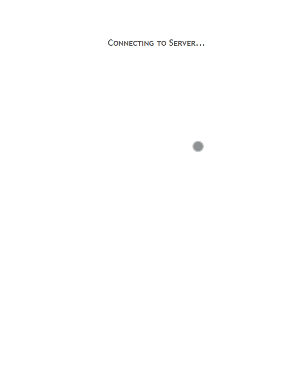

# UniFi Netzwerk Status für Material Design Widgets

Skript zur Anzeige des Status aller Netzwerk Geräte mit dem Unifi Adapter.

**Hinweis: Das Skript funktioniert nicht 'out of the box' und benötigt ggf. Anpassungen, d.h. man sollte sich mit javascript etwas auskennen.**

Mit diesem Skript wird ein json string erzeugt mit dem Status aller Netzwerk Geräte mit dem Unifi Adapter. Diese Daten (Datenpunkt) kann dann im Material Design IconList Widget verwendet werden, um den Status der Skripte im VIS anzuzeigen.

[](https://www.paypal.com/cgi-bin/webscr?cmd=_s-xclick&hosted_button_id=VWAXSTS634G88&source=url)



### Voraussetzungen

###### Folgende Adapter werden benötigt:
* [Material Design Widgets](https://github.com/Scrounger/ioBroker.vis-materialdesign) >= 0.2.66
* [UniFi Adapter](https://github.com/iobroker-community-adapters/ioBroker.unifi) >= 0.5.8

###### Folgende NPM Module und Einstellung im Javascript Adapter:
* moment
* moment-timezone
* moment-duration-format
* mathjs
* Einstellung `Erlaub das Kommando "setObject"` muss aktiviert sein


### Installation

1. [Skript herunterladen](UnifiNetworkState.js) und unter Skripte anlegen
1. Skript Einstellungen anpassen, im oberen Bereich des Skriptes gibt es verschiedene Einstellungsmöglichkeiten inkl. derer Beschreibung.
1. [View importieren](UnifiNetworkStateView.json) 
1. (Optional) [Geräte View importieren](DevicesView.json)
1. Bilder (pfad ist in den Skript Einstellungen zu setzen) und Link Funktion (das es als Button funktioniert) werden im Unifi Controller konfiguriert:

     
  
    Bei Anmerkung (note) müsste ihr einen json string hinterlegen, der so aussieht:

    ```json
    {
        "image": "shelly_plug_s",
        "icon": "floor-lamp",   
        "link": "http"
    }
    ```

    Bei image tragt ihr den namen des Bildes ein (ohne Dateierweiterung !!!)
    
    Wenn ihr einen Link haben wollt - also durch anklicken auf eine Seite weitergeeitet werden wollt, dann könnt ihr bei link `http`, `https`, oder eine Adresse angeben z.B. `https://forum.iobroker.net/topic/4514/adapter-iobroker-unifi`
    
    Wenn ihr http oder https angebt, dann wird durch das skript automatisch die IP dran gehängt, z.B. bei Shelly, Sonoff sehr praktisch.
    
    Optional: für die Geräte View könnt ihr einen "icon" aus den [material design icons](https://materialdesignicons.com>) wählen _(Hinweis: nicht alle sind im [Material Design Widgets](https://github.com/Scrounger/ioBroker.vis-materialdesign) enthalten)_

    Wenn ihr nur ein Image haben wollt, dann sieht der json string so aus:
  
    ```json
    {
        "image": "shelly_plug_s"
    }
    ```

    Standard Bilder für lan und wlan müssen folgenden Dateinamen haben:

    - [lan_noImage.png](img/lan_noImage.png)

      

    - [wlan_noImage.png](img/wlan_noImage.png)

      


### Links
* [Thema im ioBroker Forum](https://forum.iobroker.net/topic/30875/material-design-widgets-unifi-netzwerk-status)

### Changelog

##### 2.0.0 (16.10.2020)
* (cdellasanta) Translated code and comments from to english
* (cdellasanta) Code cleanup
* (cdellasanta) Multi-language support for displayed texts
* (cdellasanta) States auto creation
* (cdellasanta) Use `moment.fromNow()` for online/offline intervals
* (cdellasanta) Optional: Additional "Display" view for listing and content display (iFrame) of devices with "links" 

##### 1.1.0 (15.09.2020)
* (web4wasch) Optimized for UniFi Adapter >= 0.5.0

##### 1.0.0 (05.03.2020)
* (Scrounger) intial release
