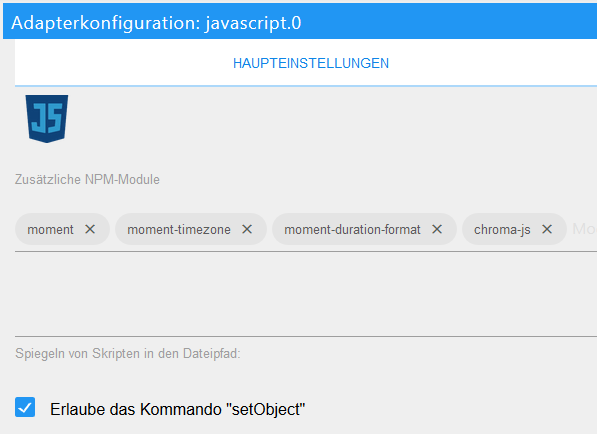
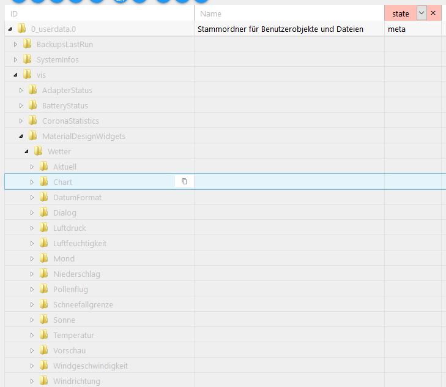

# Wetter Beispiel Projekt für Material Design Widgets

Ein Beispiel Projekt für eine responsiv VIS View mit Wetter Daten.

[](https://www.paypal.com/cgi-bin/webscr?cmd=_s-xclick&hosted_button_id=VWAXSTS634G88&source=url)

 

### Voraussetzungen

###### Folgende Adapter werden benötigt:
* [Material Design Widgets](https://github.com/Scrounger/ioBroker.vis-materialdesign) >= 0.3.6
* [DasWetter](https://github.com/rg-engineering/ioBroker.daswetter) >= 3.0.1
* [weatherunderground](https://github.com/iobroker-community-adapters/ioBroker.weatherunderground) >= 3.2.1
* [Pollenflug](https://github.com/schmupu/ioBroker.pollenflug) >= 1.0.4 (optional)
* [Javascript ](https://github.com/ioBroker/ioBroker.javascript) >= 4.6.1

###### Folgende NPM Module und Einstellung im Javascript Adapter:
* moment
* moment-timezone
* moment-duration-format
* chroma-js
* Einstellung `Erlaub das Kommando "setObject"` muss aktiviert sein



### Installation

1. [Skript herunterladen](DasWetter.js) und unter Skripte anlegen
2. zweimal das Skript ausführen. Beim ersten Mal werden die Datenpunkte angelegt, beim zweiten Mal die Werte erzeugt. So sieht dann die Sturktur der erzeugenten Datenpunkte aus:<br><br>
3. [Beispielprojekt](Material-Design-Widgest_Weather.zip) in VIS importieren

### Skript Einstellungen
Im oberen Bereich des skriptes gibt es verschiedene Einstellungsmöglichkeiten inkl. derer Beschreibung

```
// Skript Einstellungen *************************************************************************************************************************************************
let dasWetter_Tage = 5;                                                                                         // Anzahl der Tage für Adapter DasWetter die angezeigt werden soll

let idDatenpunktPrefix = '0_userdata.0'                                                                         // '0_userdata.0' or 'javascript.x'
let idDatenPunktStrukturPrefix = 'vis.MaterialDesignWidgets.Wetter'                                             // Struktur unter Prefix

let idSensor_Temperatur = 'linkeddevices.0.Sensoren.Temperatur.Aussen.Temperatur'                               // Temperatur des eigenen Sensor
let idSensor_Luftfeuchtigkeit = 'linkeddevices.0.Sensoren.Temperatur.Aussen.Luftfeuchtigkeit'                   // Luftfeuchtigkeit des eigenen Sensor

let color_graph_temperatur_verlauf = [                                                                          // Farben für Charts - Temperaturverlauf, value = Temperatur
    { value: -20, color: '#5b2c6f' },
    { value: 0, color: '#2874a6' },
    { value: 14, color: '#73c6b6' },
    { value: 22, color: '#008000' },
    { value: 27, color: '#FFA500' },
    { value: 35, color: '#FF0000' }
]

let color_graph_regenwahrscheinlichkeit = '#0d47a1';                                                            // Farbe Charts - Regenwahrscheinlichkeit
let color_graph_niederschlag = '#6dd600';                                                                       // Farbe Charts - Niederschlag

let enablePollenFlug = true;                                                                                    // PollenFlug Adapter verwenden
let idPollenFlugRegion = 'pollenflug.0.region#112.summary'                                                      // Id des Summary Channels deiner Region
let pollenFlugFarben = ['#57bb8a', '#94bd77', '#d4c86a', '#e9b861', '#e79a69', '#dd776e', 'red']                // Farben für die Pollenflug darstellung (Werte 0 - 6)
let pollenFlugText = ['keine', 'kaum', 'gering', 'mäßig', 'mittel', 'hoch', 'stark']                            // Texte für die Pollenflug darstellung (Werte 0 - 6)
// **********************************************************************************************************************************************************************


// Fortgeschrittene Einstellungen ***************************************************************************************************************************************
let idIconList_Vorschau = `${idDatenpunktPrefix}.${idDatenPunktStrukturPrefix}.Vorschau.IconList`;              // Datenpunkt für IconList Widget Vorschau
let idIconList_Vorschau_Chart = `${idDatenpunktPrefix}.${idDatenPunktStrukturPrefix}.Vorschau.Chart`;           // Datenpunkt für IconList Widget Vorschau

let idDialogSchalter = `${idDatenpunktPrefix}.${idDatenPunktStrukturPrefix}.Dialog.Day_`                        // Schalter Datenpunkt für Dialog Widget Luftfeuchtigkeit (wird pro Tag erzeugt mit angehängter Nummer)

let idDatum = `${idDatenpunktPrefix}.${idDatenPunktStrukturPrefix}.DatumFormat.Day_`                            // Datenpunkt für Formatierung Datum (wird pro Tag erzeugt mit angehängter Nummer)
let idTemperatur = `${idDatenpunktPrefix}.${idDatenPunktStrukturPrefix}.Temperatur.Day_`                        // Datenpunkt für List Widget Temperatur (wird pro Tag erzeugt mit angehängter Nummer)
let idNiederschlag = `${idDatenpunktPrefix}.${idDatenPunktStrukturPrefix}.Niederschlag.Day_`                    // Datenpunkt für List Widget Niederschlag (wird pro Tag erzeugt mit angehängter Nummer)
let idLuftfeuchtigkeit = `${idDatenpunktPrefix}.${idDatenPunktStrukturPrefix}.Luftfeuchtigkeit.Day_`            // Datenpunkt für List Widget Luftfeuchtigkeit (wird pro Tag erzeugt mit angehängter Nummer)
let idWindgeschwindigkeit = `${idDatenpunktPrefix}.${idDatenPunktStrukturPrefix}.Windgeschwindigkeit.Day_`      // Datenpunkt für List Widget Windgeschwindigkeit (wird pro Tag erzeugt mit angehängter Nummer)
let idWindrichtung = `${idDatenpunktPrefix}.${idDatenPunktStrukturPrefix}.Windrichtung.Day_`                    // Datenpunkt für List Widget Windrichtung (wird pro Tag erzeugt mit angehängter Nummer)
let idLuftdruck = `${idDatenpunktPrefix}.${idDatenPunktStrukturPrefix}.Luftdruck.Day_`                          // Datenpunkt für List Widget Luftdruck (wird pro Tag erzeugt mit angehängter Nummer)
let idSchneefallgrenze = `${idDatenpunktPrefix}.${idDatenPunktStrukturPrefix}.Schneefallgrenze.Day_`            // Datenpunkt für List Widget Schneefallgrenze (wird pro Tag erzeugt mit angehängter Nummer)
let idSonne = `${idDatenpunktPrefix}.${idDatenPunktStrukturPrefix}.Sonne.Day_`                                  // Datenpunkt für List Widget Sonne (wird pro Tag erzeugt mit angehängter Nummer)
let idMond = `${idDatenpunktPrefix}.${idDatenPunktStrukturPrefix}.Mond.Day_`                                    // Datenpunkt für List Widget Mond (wird pro Tag erzeugt mit angehängter Nummer)

let idBewolkung = `${idDatenpunktPrefix}.${idDatenPunktStrukturPrefix}.Aktuell.Bewolkung`                       // Datenpunkt für List Widget Bewölkung (nur aktuell)
let idUvIndex = `${idDatenpunktPrefix}.${idDatenPunktStrukturPrefix}.Aktuell.UV-Index`                          // Datenpunkt für List Widget UV-Index (nur aktuell)
let idSonneneinstrahlung = `${idDatenpunktPrefix}.${idDatenPunktStrukturPrefix}.Aktuell.Sonneneinstrahlung`     // Datenpunkt für List Widget idSonneneinstrahlung (nur aktuell)
let idMeineSensoren = `${idDatenpunktPrefix}.${idDatenPunktStrukturPrefix}.Aktuell.MeineSensoren`               // Datenpunkt für List Widget idSonneneinstrahlung (nur aktuell)

let idChart = `${idDatenpunktPrefix}.${idDatenPunktStrukturPrefix}.Chart.Day_`                                  // Datenpunkt für Chart Widget Werte des Tages (wird pro Tag erzeugt mit angehängter Nummer)

let idVisibiltyPollenFlug = `${idDatenpunktPrefix}.${idDatenPunktStrukturPrefix}.Pollenflug.visible`            // Datenpunkt um Pollenflug views anzuzeigen oder auszublenden
let idPollenflug = `${idDatenpunktPrefix}.${idDatenPunktStrukturPrefix}.Pollenflug.Day_`                        // Datenpunkt Pollenflug für Bar Chart Widget (wird für heute und morgen erzeugt)
// **********************************************************************************************************************************************************************
```

### Links
* [Thema im ioBroker Forum](https://forum.iobroker.net/topic/32232/material-design-widgets-wetter-view)

### Vielen Dank an
* [sigi234](https://forum.iobroker.net/user/sigi234): für die Insperation, als Basis hab ich mich an [seinem Wetter Projekt](https://forum.iobroker.net/topic/20675/projekt-wetterview-von-sigi234) orientiert
* [Mic](https://forum.iobroker.net/user/mic): für sein Skript um Datenpunkte unter `0_userdata.0` zu ereugen. [Das Skript findet ihr hier](https://github.com/Mic-M/iobroker.createUserStates)

### Changelog

### 1.0.4 (19.05.2020)
* (Scrounger) bug fix graphs y-Axis range, Javascript Adapter >= 4.6.1 needed, DasWetter >= 3.0.1 needed

### 1.0.3 (29.04.2020)
* (Scrounger) new feature of Material Design Widgets 0.3.6 added: auto show data labels on chart

### 1.0.2 (13.04.2020)
* (Scrounger) trigger bug fix
* (Scrounger) Pollenflug Adapter optional

### 1.0.0 (13.04.2020)
* (Scrounger) intial release
